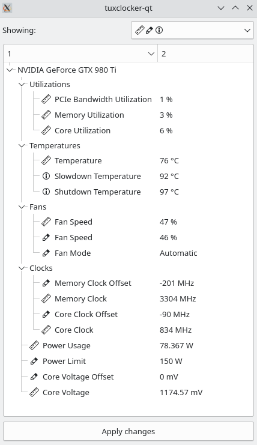
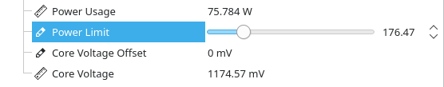

# Installation

## Dependencies

`qt (charts, base, dbus), boost-system, boost-filesystem, libnvml  (cuda), libxnvctrl, xlib, libdrm, meson`

Note that these packages are likely called something different on each distribution.

## Meson options

```
--prefix=<path> (install location prefix, usually '/usr')
-Dplugins=<true/false>
-Ddaemon=<true/false> (builds and installs 'tuxclockerd' binary/daemon)
```

```
git clone https://github.com/Lurkki14/tuxclocker
cd tuxclocker
git checkout cpplib
git submodule init
git submodule update
meson build <meson options>
cd build
ninja && sudo ninja install

```

# Screenshots

### Main view



### Editing an item



# Developing

### Formatting

TuxClocker uses `clang-format`. Code should be formatted with the provided `clangFormat.sh` script.

NOTE: to get designated initializers formatted like so:
``` cpp
auto Foo = Foo{
    .bar = 1,
    .baz = 2,
};
```
a trailing comma should be used after the last member (`clang-format` weirdness).

### Scripts

There are a few scripts in `dev/` for development convenience, mainly to deal with DBus. A separate DBus instance and custom config file is used, so the TuxClocker daemon is able to be registered without installing service files into the system.

Note: the following scripts assume TuxClocker is installed to `inst/`, so `meson` should be called as follows:

`meson build --prefix=$(pwd)/inst`


The scripts should be used in this order (they all have to be running simultaneously, so probably best to run in separate terminals):

`dev/dbus-start.sh` Starts a separate DBus instance.

`dev/tuxclockerd-start.sh` Launches `tuxclockerd` making it connect to our separate DBus instance and LD_LIBRARY_PATH set to find the built `libtuxclocker`.

`dev/gui-start.sh` Launches the TuxClocker GUI making it connect to our separate DBus instance, so it can find the TuxClocker DBus service.

You can also use a program like `d-feet` if you are only making changes to the daemon. (To be documented)
